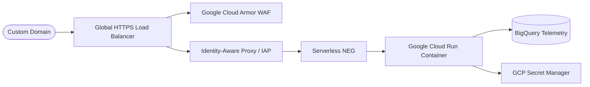
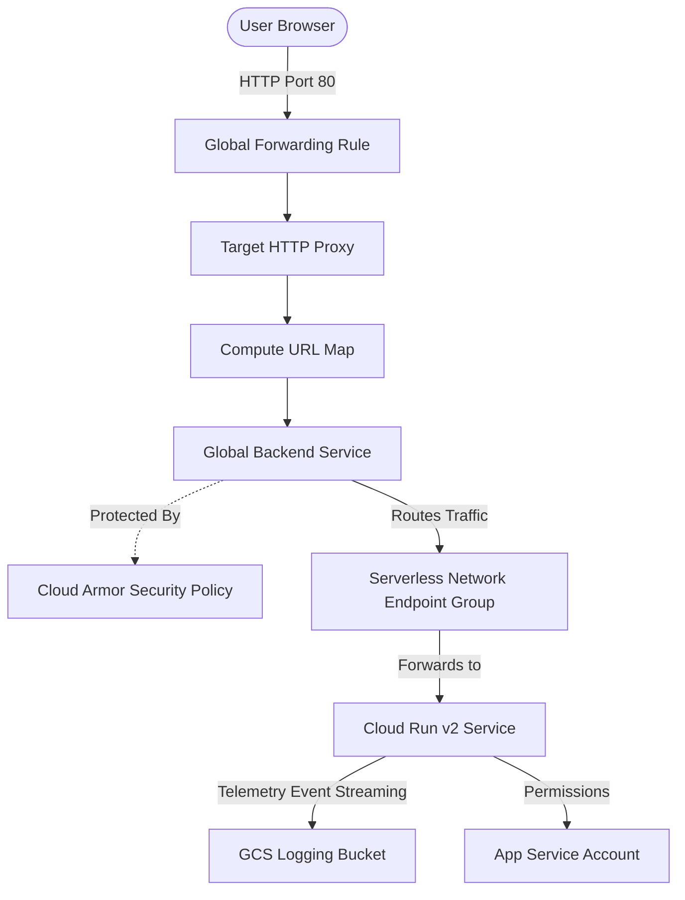

# Cloud Production Deployment & Roadmap 🚀

This document details the blueprint for deploying the Multi-Agent Travel Assistant to Google Cloud as a robust, secure, and production-grade web application, followed by a future engineering enhancement roadmap.

---

## 🏗️ Google Cloud Production Architecture

Deploying an ADK multi-agent system to production requires securing the ingress paths, managing authentication, and scaling dynamically. Below is the blueprint for a standard production-grade deployment on GCP.



---

## 🚀 Implemented Production Infrastructure & Deployment Guide

This repository contains **100% production-ready, fully implemented** assets for both application containerization and GCP infrastructure provisioning.

### 📦 1. Implemented Docker Containerization (`Dockerfile`)
A standardized, optimized `Dockerfile` is provided in the root of the project. It uses a secure, slim base image (`python:3.12-slim`) and leverages the advanced **Astral uv package manager** for deterministic, fast dependency synchronization.
*   **Source File**: [Dockerfile](file:///home/sayem/temp-mcp-agent/Dockerfile)
*   **Key Highlights**:
    *   Exposes Port `8080` for web and API traffic.
    *   Copies and syncs the FastAPI app and the custom search MCP server.
    *   Runs the production server cleanly using `uv run uvicorn`.

### 🛠️ 2. Implemented Infrastructure-as-Code (`deployment/terraform`)
The entire GCP resource topology is codified inside the [deployment/terraform/single-project](file:///home/sayem/temp-mcp-agent/deployment/terraform/single-project) directory.

Running `terraform apply` provisions a highly resilient, enterprise-grade architecture:



#### 🏗️ Codified GCP Resource Mapping
1.  **GCP API Activations (`apis.tf`)**: Enables Compute Engine, Cloud Run, Vertex AI, BigQuery, IAM, and Resource Manager services programmatically.
2.  **Least-Privilege Security (`iam.tf`)**: Creates a dedicated application service account (`app-sa`) and binds strict, minimal IAM roles (Vertex AI User, GCS Admin, Cloud Trace Agent, Logging Writer).
3.  **Horizontal Scale Compute (`service.tf`)**: Provisions a **Google Cloud Run v2 service** executing your container, configured with:
    *   Auto-scaling ranges (1 to 10 instances).
    *   Secure environment variable bindings.
    *   Stateful **Session Affinity** enabled to optimize browser-to-backend request flows.
    *   `ignore_changes` lifecycle hook on the container image tag to prevent Terraform from accidentally downgrading live CI/CD deployments.
4.  **Telemetry Storage (`storage.tf` & `telemetry.tf`)**: Provisions a secure, locked-down Cloud Storage bucket to act as an immediate queue/ingestion point for telemetry logs.
5.  **OWASP Top 10 Defenses (`load_balancer.tf`)**: Configures **Google Cloud Armor** with three robust, preconfigured filtering rules to immediately block SQL Injection (SQLi), Cross-Site Scripting (XSS), Remote Code Execution (RCE), and Local File Inclusion (LFI) attempts.
6.  **Edge Ingress Routing (`load_balancer.tf`)**: Provisions:
    *   A **Global Static IP Address** allocation.
    *   A **Serverless Network Endpoint Group (NEG)** targeting the Cloud Run application.
    *   An **External Managed Backend Service** protected by your Cloud Armor policy.
    *   A Global **Compute URL Map**, **Target HTTP Proxy**, and **Global Forwarding Rule** mapping incoming port 80 traffic to your serverless backend.
    *   A commented, drop-in blueprint for mapping your **Custom Domain** (e.g., DuckDNS) over secure HTTPS (Port 443) using Google-Managed SSL Certificates.

---

## 🔒 Enterprise Security Hardening (Real-World Case Study)

When deploying inside corporate, multi-tenant GCP organizations, several security constraints govern resource accessibility. Below are key security integration patterns implemented during our project design:

### 1. Google Cloud Armor (WAF Protection)
Protect your load balancer backend from common web application exploits (OWASP Top 10) by configuring a Cloud Armor security policy:
```bash
gcloud compute security-policies create travel-armor-policy
```
Add standard pre-configured rules to block SQL Injection (SQLi), Cross-Site Scripting (XSS), and Remote Code Execution (RCE/LFI):
*   *SQLi block (Priority 2000)*: `evaluatePreconfiguredExpr('sqli-v33-stable')`
*   *XSS block (Priority 2010)*: `evaluatePreconfiguredExpr('xss-v33-stable')`

### 2. Identity-Aware Proxy (IAP) & Organization Policy Isolation
Enterprise projects often restrict anonymous internet ingress via organization policy constraints such as **`constraints/iam.allowedPolicyMemberDomains`**. This explicitly blocks granting the `run.invoker` role to `allUsers` (the general public) and restricts account additions to approved domains.

To bypass this safely and permit secure, authorized access for corporate employees:
1.  **Enable IAP** on your backend service:
    ```bash
    gcloud compute backend-services update travel-backend --iap=enabled --global
    ```
2.  **Apply Granular Backend IAM Bindings**: Grant the `roles/iap.httpsResourceAccessor` role specifically to the backend service resource rather than at the project root level to enforce the principle of least privilege:
    ```bash
    gcloud iap web add-iam-policy-binding \
        --resource-type=backend-services \
        --service=travel-backend \
        --member="user:employee@yourdomain.com" \
        --role="roles/iap.httpsResourceAccessor"
    ```
3.  **OAuth Consent Screen Domain Isolation**: Note that if the project's parent organization is a partner/support domain (such as `telus.premium-cloud-support.com`) and the IAP OAuth Brand is set to `orgInternalOnly: true`, identities outside that specific G-Suite workspace (even `@google.com` or `@gmail.com` accounts with IAP roles) will be blocked from logging in. For public access, deployment should be isolated to an independent, personal GCP sandbox.

---

## 📈 Future Engineering Enhancements (Project Roadmap)

To expand this system from a working prototype to a highly scalable, enterprise-grade cognitive platform, the following roadmap is planned:

### 1. Distributed State & Multi-Session Persistence (Scalability)
*   **Problem**: The current ADK prototype uses local, in-memory session tracking. When autoscaling multiple Cloud Run instances, requests from the same user session hitting different instances will lose conversational context.
*   **Enhancement**: Integrate **Google Cloud Memorystore (Redis)** as a fast, centralized cache layer to store active agent session trees and state parameters.
*   **Database**: Set up **Cloud Spanner** or **Cloud SQL (PostgreSQL)** to persist historical transaction threads and analytical reporting over time across regions.

### 2. Retrieval-Augmented Generation (RAG) Integration
*   **Problem**: The travel assistant currently relies on real-time web scrapers and external REST APIs, which are highly volatile and rate-limited.
*   **Enhancement**: Establish a **Vertex AI Agent Builder Datastore** (Search and Vector Search) pre-populated with curated regional travel catalogs, airline schedules, and PDF brochures. 
*   **Execution**: Connect the datastore tool directly to the `activities_travel_agent` to ground suggestions in verified, cached corporate travel repositories.

### 3. Automated CI/CD Pipeline (DevOps)
*   **Enhancement**: Configure a **GitHub Actions workflow** or **Google Cloud Build trigger** that fires on every git merge.
*   **Pipeline Tasks**:
    1.  Lints code format with `ruff` and runs type validation with `mypy`.
    2.  Executes local unit tests with `pytest`.
    3.  Automates systematic quality checks by triggering the `agents-cli eval run` suite.
    4.  Builds the container image, publishes it to Artifact Registry, and deploys it as a revision to Cloud Run upon successful evaluation scores.
